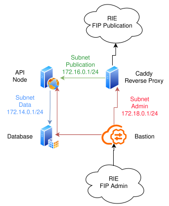
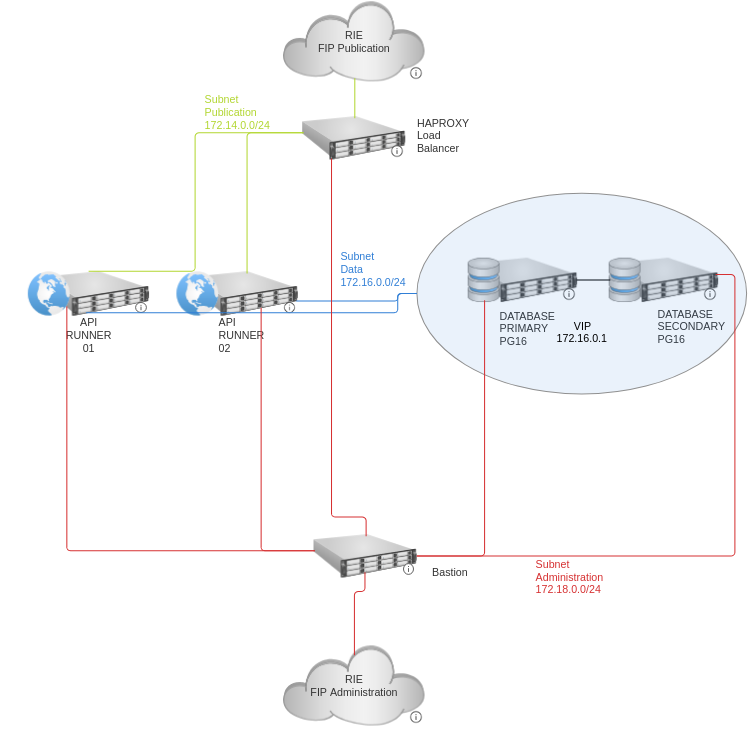

# SharedAgenda
SharedAgenda is our project for the end of our year as probationary civil
servants in ENFiP Toulouse as Inspectrices PSE.

The deployed version of SharedAgenda is v2.0.0. See the diagrams below.

It has two different main components, the [server](crates/server) and the
[cli](crates/cli).

See their different README for more information and documentation.

## Build
To build SharedAgenda you first need to install `podman` on your machine. 
Then, use this command to create a podman container suitable for compiling the
server.

The script `builder` is here if you don't have a rust toolchain installed on
your machine. It uses the podman container to compile without need to install
the toolchain.

```sh 
podman build -t rust-builder -f Containerfile
```

Use the script `cargo-podman` to compile the server.

### All
```sh
make all
```

### Server
```sh
./builder build --release --bin server
#OR 
cargo podman build --release --bin server #with the rust toolchain installed
#OR 
make server
```

### Client
```sh
./builder build --release --bin cli
#OR
cargo podman build --release --bin cli #with the rust toolchain installed
#OR 
make cli
```

Alternatively you can use the pre-compiled binaries
- `server` is in `02-configuration/files/server`
- `cli` is in `assets/cli`

## Deployment
SharedAgenda is hosted on NUBO, it uses _terraform_ for the creation of the VMs
and _ansible_ for the configuration. 

### Deployment on NUBO
You need to place `clouds.yaml` and `secure.yaml` in `01-platform` and sim link
them in `02-configuration`

```sh 
. env.sh #do the steps
python3 -m pip install -r r.txt #install the components

cd 01-platform
tf apply #deploy the infrastructure

cd ../02-configuration
ansible-playbook -i inventory sharedagenda.playbook.yaml #configure servers
```

## Documentation

See the [server's README](crates/server/README.md) for the endpoints and how to
use the API.

See the [cli's REAMDE](crates/cli/README.md) for how to use the CLI/REPL.

## Diagram

### V1
Here is the diagram for the deployed V1 infrastructure.

[](assets/infrastructure_v1.png)

### V2
Here is the diagram for the deployed V2 infrastructure.

[](assets/infrastructure_v2.png)
